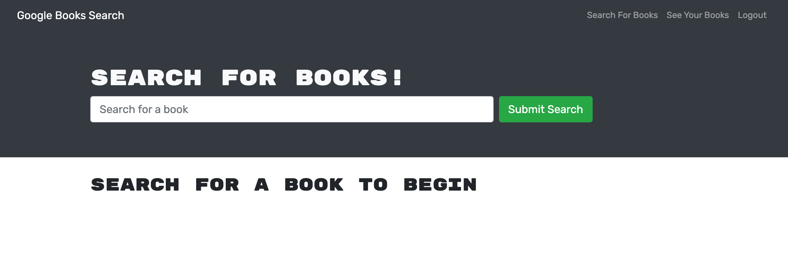
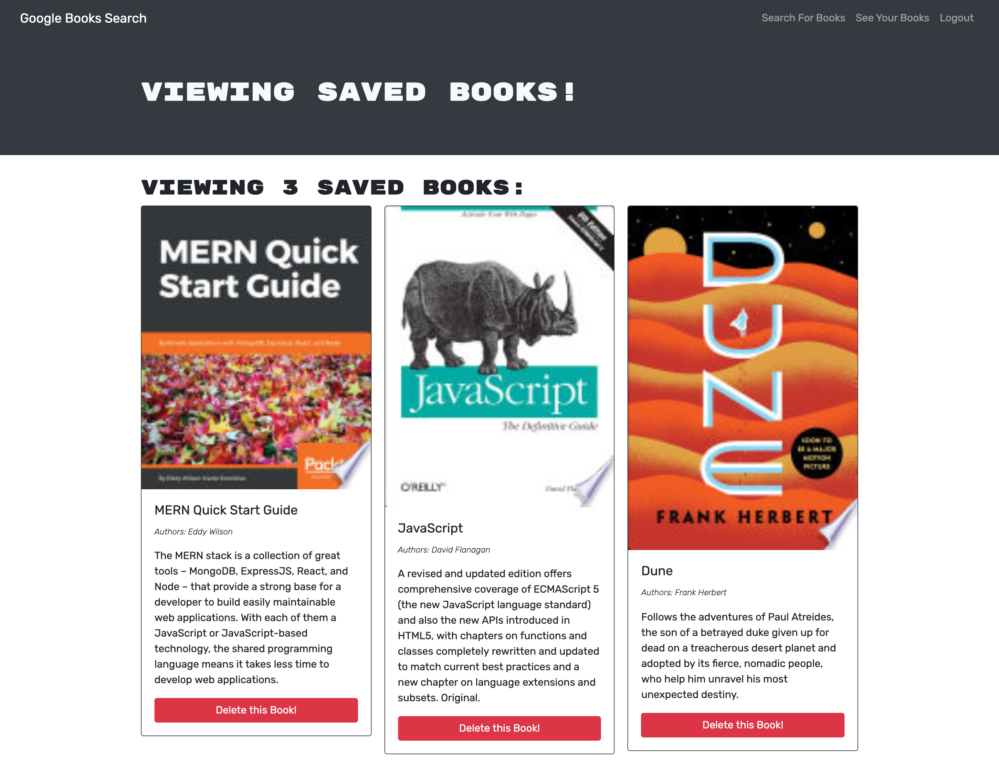
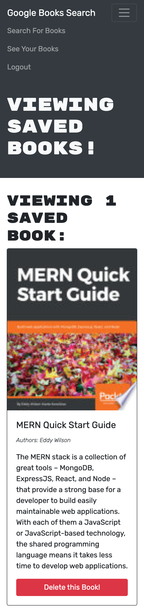

# Book-Search-Engine

Link to deployed site on Heroku: https://readingbooksgood.herokuapp.com/

## Description
 This project was started with a functioning Google Books API search engine built with a RESTful API, and refactored to be a GraphQL API built with Apollo Server. The app was created using the MERN stack with a React front end, MongoDB database, and Node.js/Express.js server and API. It allows users to search and save books. This was a great way to learn about a MERN stack application and learning how to deploy it to Heroku. For future version, I would like to update the homepage. 

## Table of Contents
- [Installation](#installation)
- [Usage](#usage)
- [Contributing](#contributing)
- [Screenshots](#screenshots)
- [License](#license)
- [Questions](#questions)
- [Acknowledgments](#acknowledgments)

### Installation
After downloading this repository, go into the folder of this project. Then run npm install or i. 

### Usage
Make sure to have MongoDB installed. Then you can run npm start to run the application and create a production build. You can also use a program such as ROBO 3T to view the MongoDB collection. You can also visit the Heroku link above to see the deployed site. 

### Contributing
Feel free to fork or clone this repo and make your own versions.

## Screenshots

### Desktop view
View of the Homepage

View of the Saved Books List

### Mobile View
View of the Homepage

View of the Saved Books List

## Contact 
You can contact me at edort93@gmail.com

## License
This project is licensed under the terms of the MIT license.

## Acknowledgments
~~~
I would like to thank online resources such as W3 schools, MDN Web Docs, and Stack Overflow.
~~~